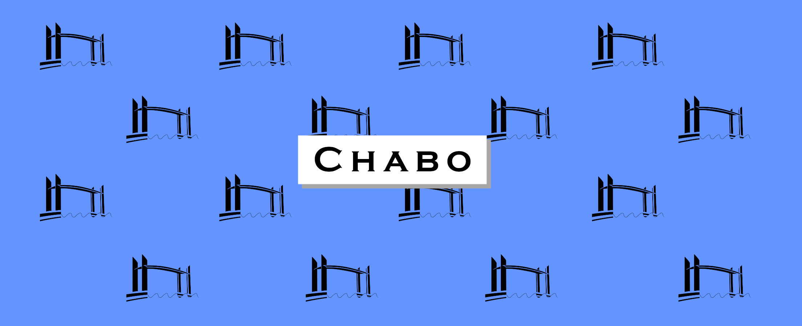

<p align="center">
  <a href="https://flutter.dev"></a> 
  <a href="https://github.com/vareversat/chabo-app/actions"></a>
  <a href="https://github.com/vareversat/chab-app/releases"></a>
  <a href="https://codecov.io/gh/vareversat/chabo-app/"></a>
</p>

Mobile app to track the schedules of the [Chaban Delmas bridge](https://fr.wikipedia.org/wiki/Pont_Jacques-Chaban-Delmas) located in Bordeaux, France.

# Credits 

 - **App icon** : 

Huge thanks to **Juliette REVERSAT** for the design of the App icon. Check out her Instagram [here](https://www.instagram.com/_sanzecailles_/)


# How to work on it ?

You need a couple of things to be able to start the app in dev mode on your own computer

1) Download the [Flutter SDK](https://flutter.dev/docs/get-started/install) according to your OS
2) Create a virtual device
3) Fork the source code (of course)

Then, you can run
```shell script
$ fluter run
```
And you are good to go :thumbsup:
